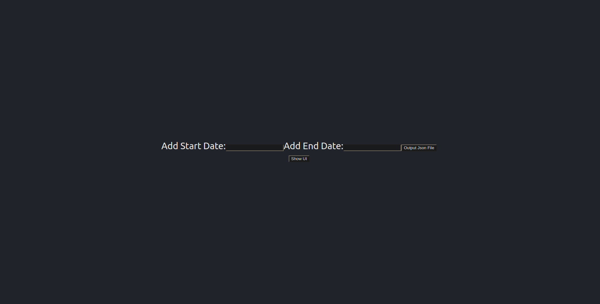
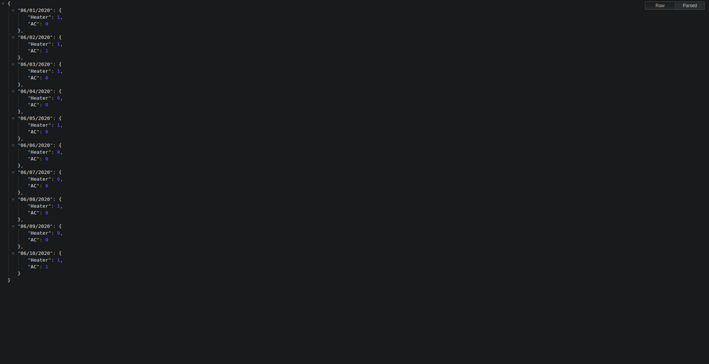
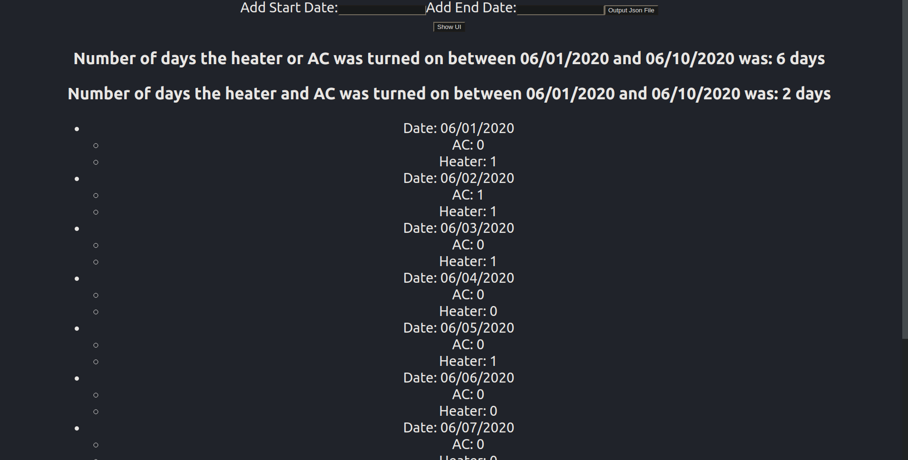

# ACHeater-Tracker

## Table of Contents
* Project
* Installation
* How it Works
* Results
* Review/Improvements

## Project
Currently, the HVAC system is set such that the air-conditioning system is turned on when the outdoor temperature is over 75 degrees Fahrenheit. Similarly, the heating system is turned on when the outdoor temperature is under 62 degrees Fahrenheit. The engineering directors want to learn how often the air-conditioning and heating systems were turned on for July 2020. In particular, they would like a summary of data that provides the following:

* For each day in the given date range, indicate whether the air-conditioning
system was turned on at least once.
* For each day in the given date range, indicate whether the heating system was
turned on at least once.

Create a Restful API with the following specifications:
* Fetch data for a month indicated by the web report
* Transform data
* Return JSON formatted data
* (Optional) Present the results in a UI

## Installation

* Built using NodeJS and ExpressJS as the backend
* ReactJS used for the UI
* The project is deployed and live through Heroku located at this link https://acheater-reporter.herokuapp.com/
* (optional) Add JSON formatter extension to browser: https://chrome.google.com/webstore/detail/json-formatter/bcjindcccaagfpapjjmafapmmgkkhgoa

## How It Works

1. Download through git clone (then run "npm install" and "npm start" and go to localhost:3001 to view app) or visit https://acheater-reporter.herokuapp.com/

2. Once page finishes loading enter dates in format "MM/DD/YYYY" within the data given (06/01/2020-07/30/2020)

3. Click "Output JSON File" button which then displays JSON data

    * Data is formatted as dates and whether the ac/heater was turned on at least once. 
        * '0' means false the ac/heater was not turned on at least once for that day and '1' means true the ac/heater was turned on at least once for that day.
    * To download the data right click and choose save as which will allow you to save JSON data.

4. Now Click the back button on the browser which brings you back to the main form. Then click the button "Show UI" which will present:

    * The amount of days the heater or ac was turned on at least once between the dates
    * The amount of days the heater and ac was turned on at least once between the dates
    * The dates included with 
        * whether the ac/heater was turned on at least once '0' = false , '1' = true

5. Thats how my project works! Here are some bug fixes I did to prevent the user from breaking the software:

    * Error popup if your dates are not formatted as "MM/DD/YYYY" (Tells you to retry)
    * Error popup if your startdate is after enddate (Tells you to retry)
    * Error popup if your dates do not include "06/01/2020" to "07/30/2020" (Tells you to retry)

6. Additional Information: 

If you enter a date such as "05/29/2020" to "06/20/2020" it will return 
* data between "06/01/2020" to "06/20/2020". 
    
Same thing if you have dates such as "07/29/2020" to "08/20/2020" it will return 
* data between "07/29/2020" to "07/30/2020".
    
If this feature is not wanted from the project manager this can be changed and could be easily fixed.

## Review Code/Improvements

    Excercise1
    ├── Client          # contains the reactjs code/modules
    |    ├── build          # build folder for deploying to heroku
    |    ├── node_modules   # 
    |    ├── public         # 
    |    ├── src                # contains app.js and weather.js and css files for reactjs
    |       ├── weather.js      # contains the weather component which contains the design
    |       ├── app.js          # weather component is pushed to app.js which is then displayed
    ├── node_modules         
    └── server          #contains the index.js which is the nodejs backend server (this is where the data manipulation is happening)                
        ├── index.js        #nodejs file which feeds data after manipulation to weather.js
        

### Ways to Improve

* Fix the design in react making it more appealing to the eyes
* Format reactjs code better by adding more components
* Fixing it so the UI shows up right away and the JSON data lets you download through a popup
